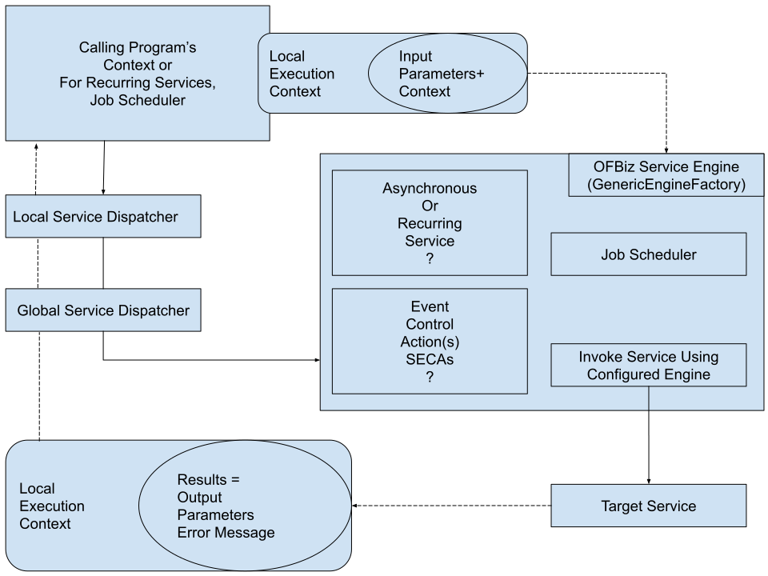

# Services | EN | OFBiz
- Context-aware Service Engine
    - Used across the entire framework
    - Or externally through network interface
    - Consumers need not to concern themselves with the location of the Service or other details related to the implementation of the service
- Multiple invocation methods
    - inline or synchronous with the calling program
    - out-of-band or asynchronous from the the caller's processing logic
    - Scheduled job
- Chaining of Services
    - Event-driven Service
    - Services can be configured to be invoked based on external events or triggers
    - The Service can also call other Service(s) based on the additional triggering Events and/or conditins
    - Services chanin together form: **Service Event Condition Action(s) or SECAs**
- Job scheduler
    - Calendar lookups
    - Frequency
    - Interval timing
- Selectable input and output validations
    - Confgured parameter types
    - Authentication and authorization (login processing with OFBiz)
    - Localization preservation across Service calls

> OFBiz Service Engine uses the factory pattern.

Third-Party execution engines including, but not limited to: 
    - Java
    - Groovy
    - JavaScript
    - JPython
    - OFBiz "simple" Service (based on the OFBiz Mini-Language)
    - The services can be pretty much be written in any language (offloading)

> The Service Engine can be called from anywhere in the framework.

## Managing existing OFBiz Services 
- Many services come out of the box with OFBiz
- https://localhost:8443/webtools/control/ServiceList

## Calling a Service from an HTML form

## Calling asynchronous Services from HTML forms

## Calling a Service many times from an HTML form

## Creating a new Service definition file

## Creating a new Service definition

## Implementing Services

## Defining Service attributes (INPUT/OUTPUT)

## Service Event Condition Actions

## Service groups

## Handling Service errors

## Writing Groovy Services

## Mail Event Conditions Actions

## Entity Event Conditions Actions

